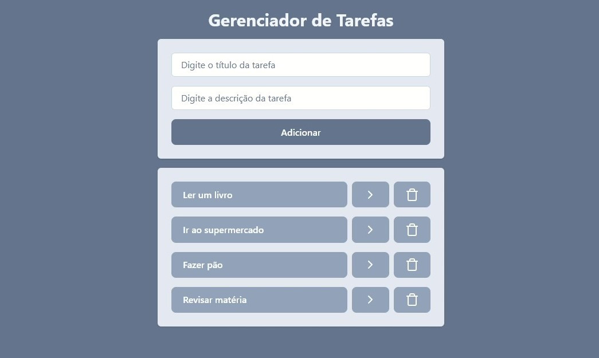
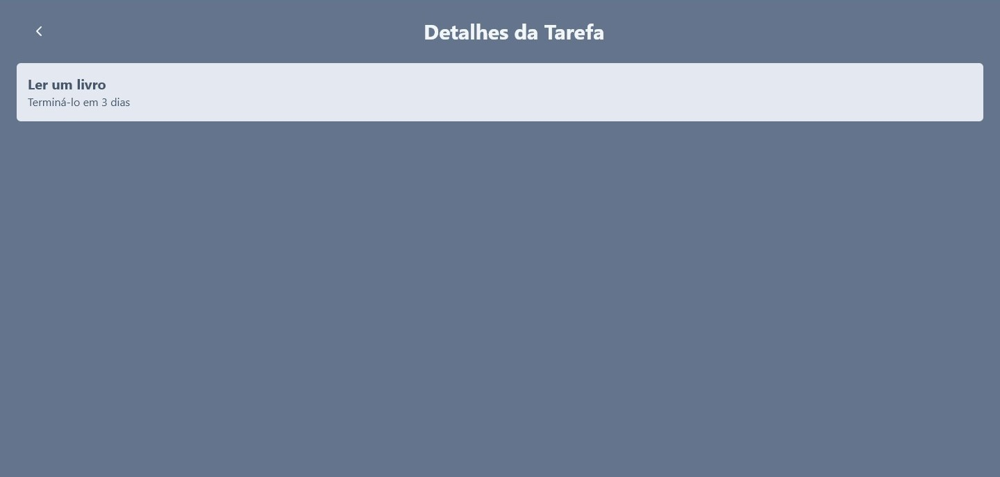

<h1 align="center">Gerenciador de Tarefas 📄</h1>
O gerenciador de tarefas faz uma lista com as novas tarefas digitadas pelo usuário, que podem ser marcadas e desmarcadas como concluídas, excluídas ou visualizadas em mais detalhes em outra página. Além disso, todas as alterações ficam salvas localmente na máquina e se a página for recarregada o conteúdo não se altera.

<h2>🎨 Layout</h2>

<p align="center">
    
    
</p>

## 💻 Tecnologias Utilizadas
- [Node.js](https://nodejs.org/) v22.15.0
- [npm](https://www.npmjs.com/) v11.3.0
- [React.js](https://react.dev/) v19.0.0
- [Vite](https://vitejs.dev/) v6.3.4
- [ESLint](https://eslint.org/) v9.22.0
- [Tailwind CSS](https://tailwindcss.com/) v4.1.5
- [Lucide React](https://lucide.dev/) v0.507.0
- JavaScript
- [Visual Studio Code](https://code.visualstudio.com/)

<h2>📁 Usando o projeto localmente</h2>

Siga os passos a seguir para usar o projeto localmente.

<h3>Pré-requisitos</h3>

É necessário ter instalado:

* Node js
* npm
* Visual studio
* Git

<h3>Clonando</h3>

Para clonar o projeto, coloque o seguinte código no terminal:

```bash
git clone https://github.com/NataliaNogueira1/gerenciador-tarefas.git
```

<h3>Como rodar o projeto</h3>

Ainda no terminal, coloque:

```bash
cd gerenciador-tarefas
npm install
npm run dev
```
